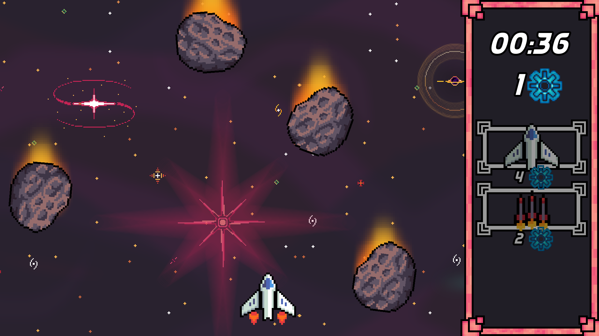

# Void Splitter

### Tiny space shoot 'em up game made with Godot 4.2.1  
This game was made in a day as practice for a game making competition.

## Features

* 2D player movement and environment
* Balanced game progression with some randomness
* Endless gameplay
* Main menu with settings including audio sliders and fullscreen mode

## Play

### **Warning: The game does not work if you are using Safari**

You can play the game on the web at:  

https://tossu.itch.io/void-splitter  

Alternatively you can download the source and build it via Godot for your system

## Credits

Art by Foozle, https://foozlecc.itch.io  
UI Art by BDragon1727, https://bdragon1727.itch.io  

Menu music by vmrrobotic, https://www.newgrounds.com/audio/listen/1215623  
Game music by PiXeLMan659, https://www.newgrounds.com/audio/listen/1242515  

Font used is Techno Race by Nirmana Visual, https://nirmanavisual.com  
